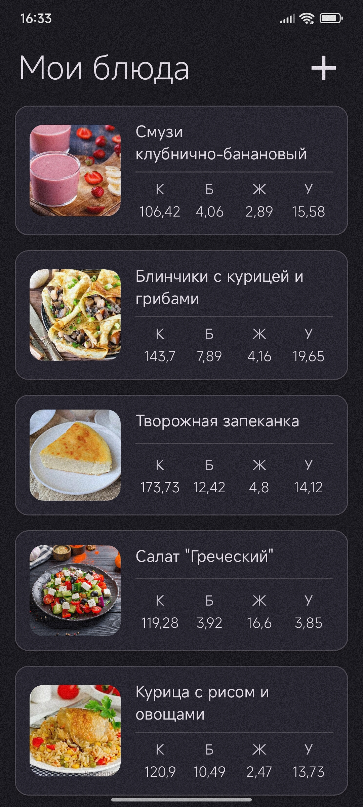
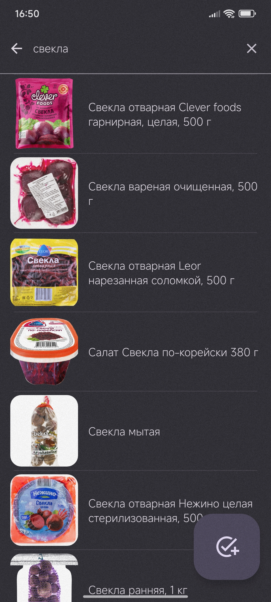
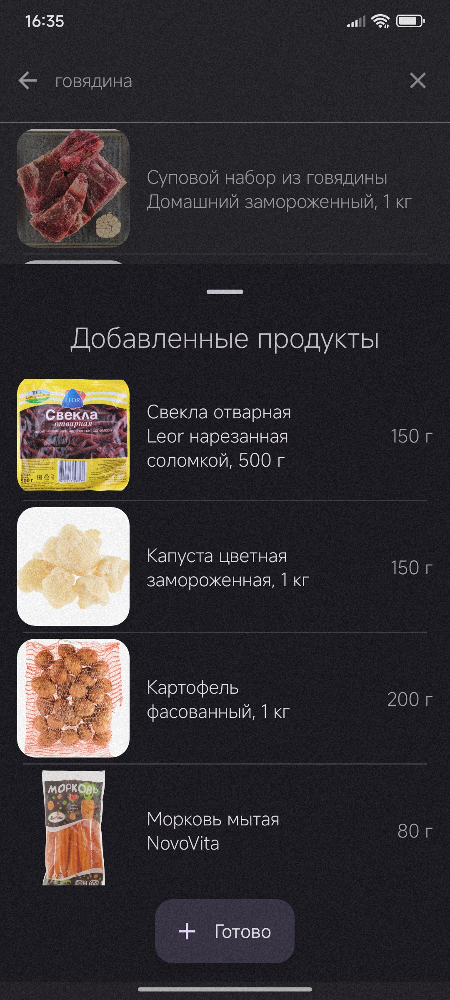
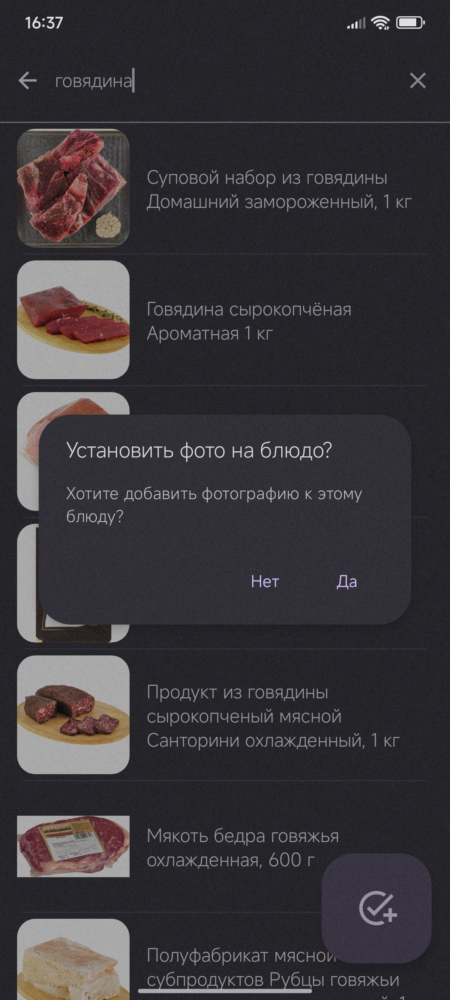
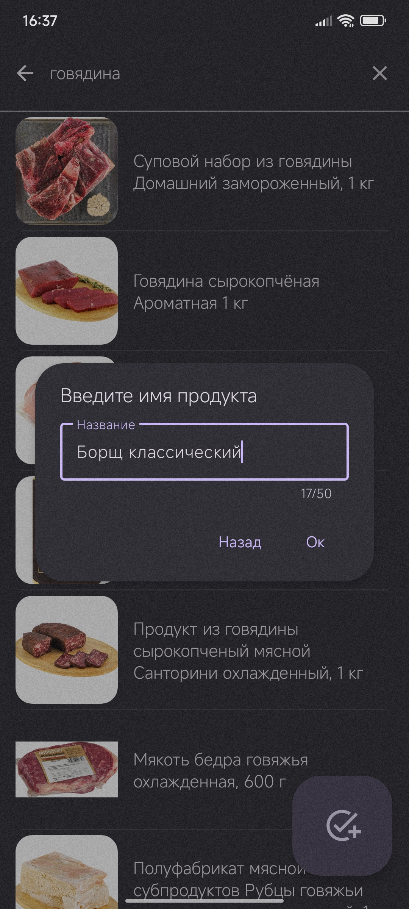
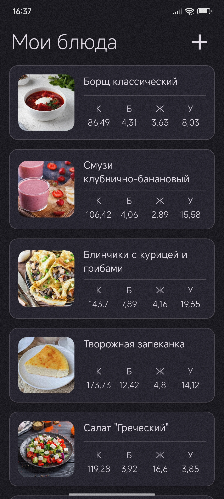
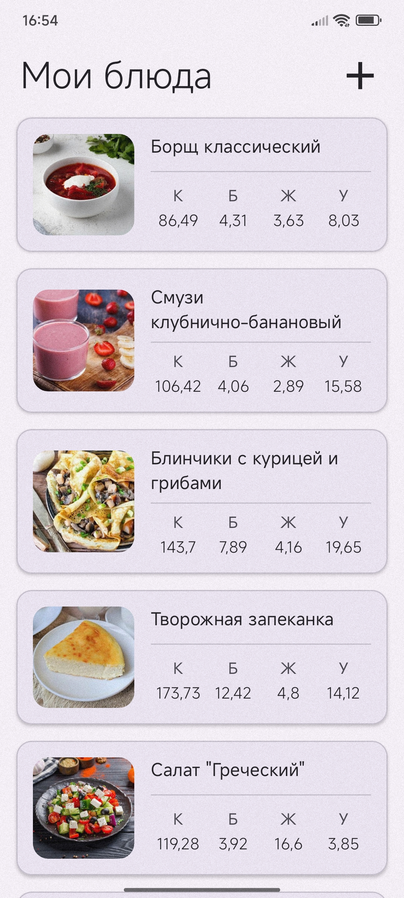

# 🍲 MyDishes — Android-приложение для расчёта КБЖУ домашних блюд

## 📌 Описание

**MyDishes** — это Android-приложение для подсчёта калорий, белков, жиров и углеводов (КБЖУ) в
домашних блюдах.
Главная цель проекта — не только создать рабочее приложение, но и выстроить архитектуру так, чтобы
код был **поддерживаемым и расширяемым**.

## 🎯 Основной функционал

* **Главный экран (MainActivity)** — список сохранённых блюд с фото, названием и автоматически
  рассчитанными КБЖУ.
* **Детали блюда (BottomSheet)** — фото, название, список ингредиентов.

  * Изменение массы ингредиента → мгновенный пересчёт КБЖУ.
  * Редактирование названия блюда → данные сохраняются сразу, без подтверждений.
* **Добавление блюда (AddActivity)**:

  * Поиск ингредиентов через парсинг [Е-доставка](https://edostavka.by).
  * Ввод массы через MaterialDialog.
  * Автоматический парсинг страницы продукта с данными КБЖУ.
  * Просмотр и редактирование выбранных ингредиентов.
  * Установка фото блюда (галерея или камера).
* **Работа с БД (Room/SQLite)**: сохранение всех данных в 3НФ.
* **Удаление блюда или ингредиента свайпом** (ItemTouchHelper).

## 🖼️ Скриншоты

<table>
  <tr style="padding:25px">
    <td align="center">
      <b>1️⃣ Экран со списком блюд</b> 
      
    </td>
    <td align="center">
      <b>2️⃣ Детали блюда</b> 
      
    </td>
  </tr>
  <tr style="padding:25px">
    <td align="center">
      <b>3️⃣ Поиск ингредиента</b> 
      
    </td>
    <td align="center">
      <b>4️⃣ Формирование блюда</b> 
      
    </td>
  </tr>
  <tr style="padding:25px">
    <td align="center">
      <b>5️⃣ Добавление фото блюда</b> 
      
    </td>
    <td align="center">
      <b>6️⃣ Ввод названия блюда</b> 
      
    </td>
  </tr>
  <tr style="padding:25px">
    <td align="center">
      <b>7️⃣ Обновлённый список блюд</b> 
      
    </td>
    <td align="center">
      <b>8️⃣ Интерфейс в светлой теме</b> 
      
    </td>
  </tr>
</table>

## 🛠️ Архитектура и используемые технологии

### 📂 Работа с данными

* **Room (SQLite)**

  * Третья нормальная форма (3NF).
  * DAO, модели, Relations.
  * `AppDatabase` реализован по паттерну **Singleton**.
  * `DataRepository` как единая точка доступа к данным.

### 🔄 Callback-архитектура

* Унифицированные callbacks: `onStart`, `onSuccess`, `onError`, `onFinish`.
* Гибкое управление UI при долгих операциях (загрузка из БД, парсинг).

### 🧩 Паттерны и подходы

* **RecyclerView Adapter**

  * Базовый `BaseAdapter`, расширяющий `ListAdapter`, чтобы сократить дублирование кода.
* **Singleton-менеджер** для промежуточных данных:

  * `ProductsSelectedManager` хранит выбранные ингредиенты.
  * Данные защищены от мутабельности.
* **Абстрактные классы и наследование**

  * `Parser` с методами `findProducts(String query)` и `parseProductDetails(Product)`.
  * Лёгкое добавление новых источников данных (например, новых магазинов).
* **Utils-модуль**

  * `DialogUtils`, `TextWatcherUtils`, `ViewUtils` — сокращение дублирования.
* **Parcelable-модели** (`Product`, `Nutrition`) — оптимизация под Android IPC.
* **FragmentResult API** для обмена данными между Activity, BottomSheet и адаптерами.

### 📱 UI и UX

* Material Components (BottomSheet, MaterialDialogs).
* DataBinding (`BottomSheetDishDetailsBinding.inflate(...)`).
* Swipe-удаления через ItemTouchHelper.
* Поддержка **динамических тем Android** (светлая/тёмная).
* UX-подход: изменения сохраняются сразу, без подтверждений.

## ⚙️ Технологии

* Java
* Android SDK
* Room (SQLite)
* Data Binding
* RecyclerView + ListAdapter
* Material Components
* Callbacks API
* ItemTouchHelper

## 📌 Что улучшено по сравнению с предыдущим проектом (LifeLine)

* Использование **Room** вместо ручных SQL-запросов.
* Архитектура с **Repository** и DAO.
* **Callback-архитектура** для асинхронных операций.
* **BaseAdapter** и Utils для сокращения дублирования.
* Введение **DataBinding**.
* Поддержка динамических тем.
* Явный акцент на паттерны проектирования (Singleton, Repository, абстрактные классы).

## 🔮 Planned improvements (реалистичные)

* 🔹 Кэширование результатов поиска ингредиентов.
* 🔹 Приоритезация популярных продуктов (те, что чаще выбирал пользователь).
* 🔹 Оптимизация парсинга (параллельные запросы, экономия трафика).
* 🔹 Улучшенный оффлайн-режим.
* 🔹 Объединение моделей базы данных и моделей приложения.

## 🌟 Future work (идеи для развития)

* ✨ Генерация названия блюда (с анимацией).
* ✨ Генерация фото блюда (AI).
* ✨ Firebase: регистрация пользователей и синхронизация данных.
* ✨ Расширенные визуальные эффекты (динамические переливы).
* ✨ “Мемо-память” для блюд (быстрый доступ к недавно изменённым).

## 🚀 Roadmap

Приложение уже имеет полный цикл работы с блюдами (создание → хранение → редактирование → удаление).
Дальнейшее развитие будет направлено на:

1. Повышение производительности и удобства.
2. Добавление “умных” функций (AI, рекомендации).
3. Интеграцию с облачными сервисами.
