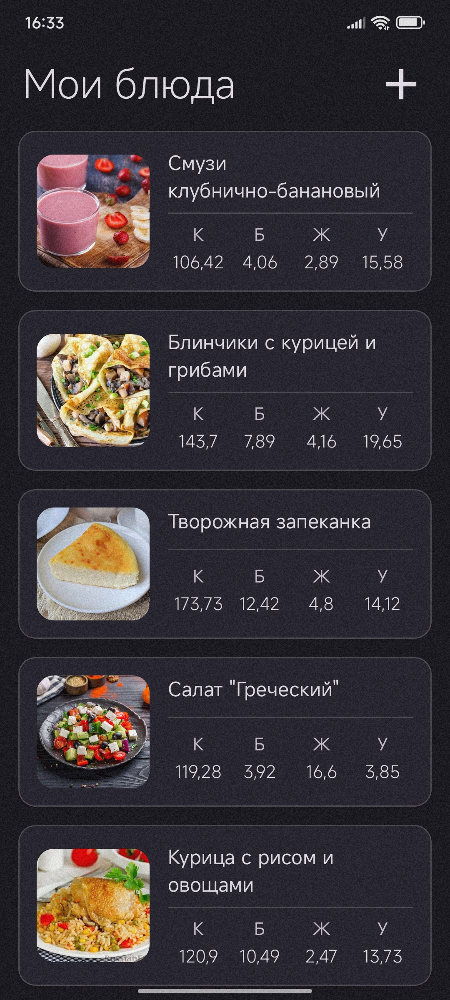
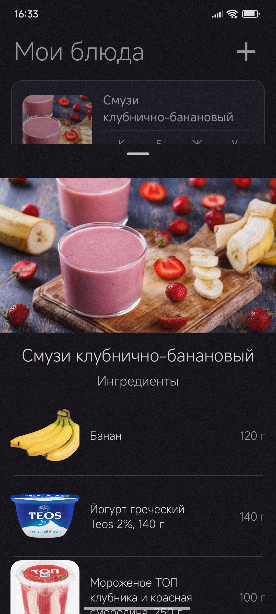
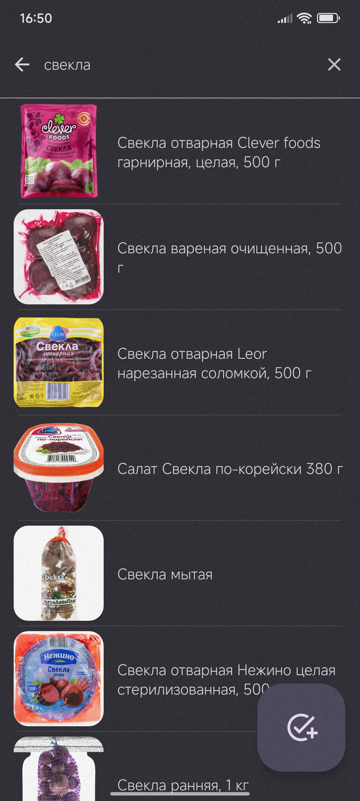
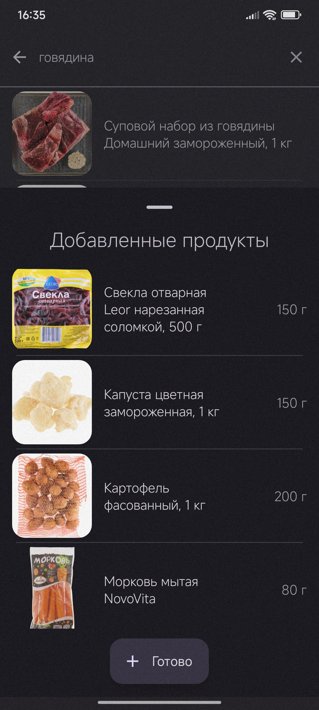
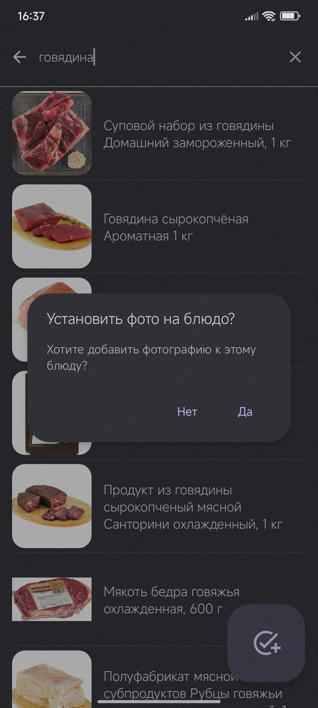
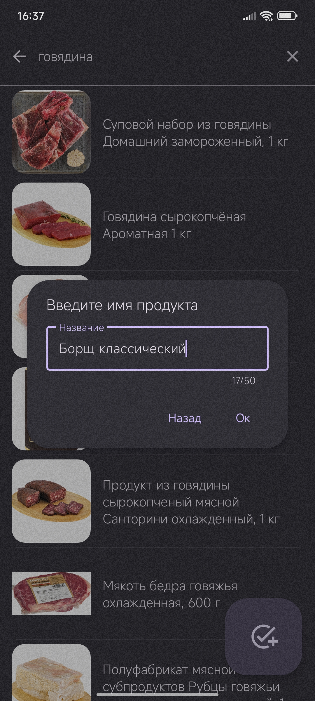
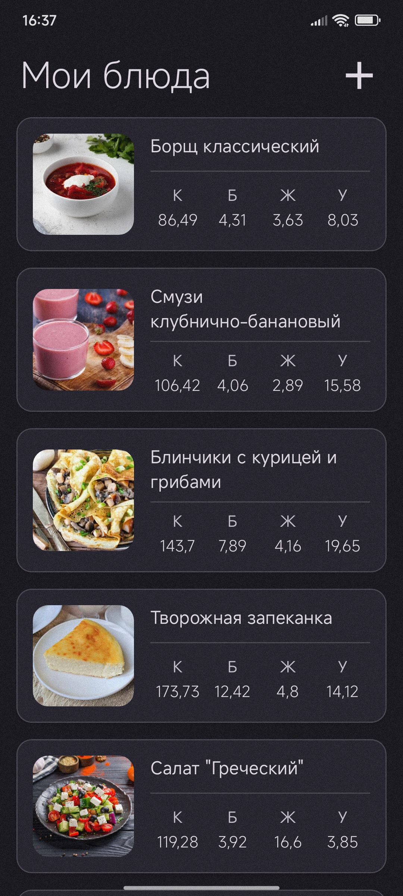
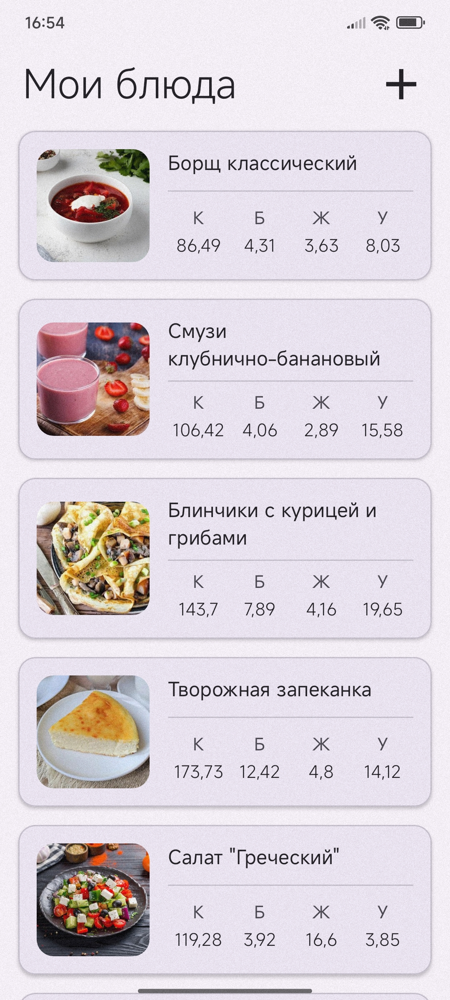

# 🍲 MyDishes — Android App for Tracking Macros of Homemade Dishes

## 📌 Description

**MyDishes** is an Android app for calculating calories, protein, fat, and carbs (macros) in
homemade dishes.
The main goal of the project is not only to build a working app, but also to design the
architecture so that the code is **maintainable and extensible**.

## 📲 Download APK

## 🎯 Core Features

* **Home screen (MainActivity)** — a list of saved dishes with a photo, name, and automatically
  calculated macros.
* **Dish details (BottomSheet)** — photo, name, ingredient list.

  * Changing an ingredient's weight → instant macro recalculation.
  * Editing the dish name → data is saved immediately, with no confirmation dialogs.
* **Adding a dish (AddActivity)**:

  * Ingredient search by scraping [E-dostavka](https://edostavka.by).
  * Weight input via MaterialDialog.
  * Automatic product page scraping with macro data.
  * Viewing and editing selected ingredients.
  * Setting a dish photo (gallery or camera).
* **Database (Room/SQLite)**: all data stored in 3NF.
* **Swipe-to-delete** for dishes and ingredients (ItemTouchHelper).

## 🖼️ Screenshots

<table>
  <tr>
    <td align="center">
      <b>1️⃣ Dish list screen</b> 
      
    </td>
    <td align="center">
      <b>2️⃣ Dish details</b> 
      
    </td>
    <td align="center">
      <b>3️⃣ Ingredient search</b> 
      
    </td>
  </tr>
  <tr>
    <td align="center">
      <b>4️⃣ Building a dish</b> 
      
    </td>
    <td align="center">
      <b>5️⃣ Adding a dish photo</b> 
      
    </td>
    <td align="center">
      <b>6️⃣ Entering a dish name</b> 
      
    </td>
  </tr>
  <tr>
    <td align="center">
      <b>7️⃣ Updated dish list</b> 
      
    </td>
    <td align="center">
      <b>8️⃣ Light theme UI</b> 
      
    </td>
  </tr>
</table>

## 🛠️ Architecture and Technologies

### 📂 Data Layer

* **Room (SQLite)**

  * Third normal form (3NF).
  * DAOs, models, Relations.
  * `AppDatabase` implemented as a **Singleton**.
  * `DataRepository` as a single point of access to data.

### 🔄 Callback Architecture

* Unified callbacks: `onStart`, `onSuccess`, `onError`, `onFinish`.
* Flexible UI control during long-running operations (database loading, scraping).

### 🧩 Patterns and Approaches

* **RecyclerView Adapter**

  * A base `BaseAdapter` extending `ListAdapter` to reduce code duplication.
* **Singleton manager** for intermediate data:

  * `ProductsSelectedManager` stores the selected ingredients.
  * Data is protected from mutability.
* **Abstract classes and inheritance**

  * `Parser` with `findProducts(String query)` and `parseProductDetails(Product)` methods.
  * Easy to add new data sources (e.g., new stores).
* **Utils module**

  * `DialogUtils`, `TextWatcherUtils`, `ViewUtils` — reducing duplication.
* **Parcelable models** (`Product`, `Nutrition`) — optimized for Android IPC.
* **FragmentResult API** for data exchange between Activity, BottomSheet, and adapters.

### 📱 UI and UX

* Material Components (BottomSheet, MaterialDialogs).
* DataBinding (`BottomSheetDishDetailsBinding.inflate(...)`).
* Swipe-to-delete via ItemTouchHelper.
* Support for **dynamic Android themes** (light/dark).
* UX approach: changes are saved instantly, without confirmation dialogs.

## ⚙️ Technologies

* Java
* Android SDK
* Room (SQLite)
* Data Binding
* RecyclerView + ListAdapter
* Material Components
* Callbacks API
* ItemTouchHelper

## 📌 Improvements Over the Previous Project (LifeLine)

* **Room** instead of raw SQL queries.
* Architecture with a **Repository** and DAOs.
* **Callback architecture** for asynchronous operations.
* **BaseAdapter** and Utils to reduce duplication.
* Introduction of **DataBinding**.
* Dynamic theme support.
* A clear emphasis on design patterns (Singleton, Repository, abstract classes).

## 📄 License and attribution

This project is available under the [Creative Commons Attribution-NonCommercial 4.0 International license](LICENSE).
You may share and adapt it for non-commercial purposes, provided that Loginov Gleb is credited and changes are indicated.
Commercial use requires prior written permission from the author.

## 🚀 Roadmap

The app already has a complete dish lifecycle (create → store → edit → delete).  
Further development will focus on:

### 🔮 Near-Term Improvements

* 🔹 Caching ingredient search results.
* 🔹 Prioritizing popular products (the ones the user picks most often).
* 🔹 Scraping optimization (parallel requests, traffic savings).
* 🔹 Improved offline mode.
* 🔹 Merging the database models and the app models.

### 🌟 Future Ideas

* ✨ Dish name generation (with animation).
* ✨ Dish photo generation (AI).
* ✨ Firebase: user registration and data sync.
* ✨ Advanced visual effects (dynamic gradients).
* ✨ "Memo memory" for dishes (quick access to recently edited ones).
